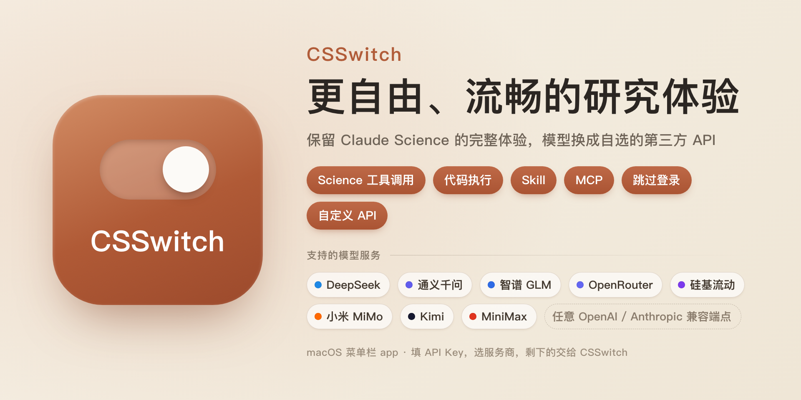
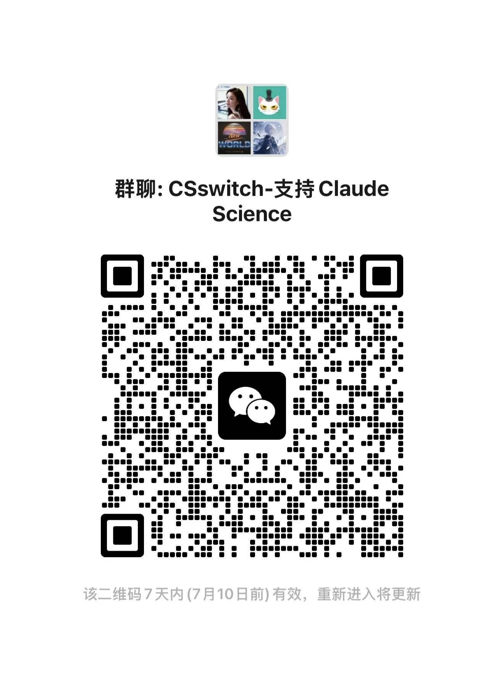

<p align="center">
  
</p>

<p align="center">
  
  
  
</p>

# CSSwitch

[Claude Science](https://claude.com) 是 Anthropic 推出的 AI Agent 科研平台，可以协助完成文献检索与分析、数据处理、图表生成和论文写作等工作。

CSSwitch 让你不必订阅 Claude，也能在 Science 中使用自己的第三方模型。填入 API Key，选择服务商，剩下的交给 CSSwitch。简单来说，它之于 Claude Science，就像 CC Switch 之于 Claude Code。

> 本仓库是包含 OpenAI 兼容端点修正和 Windows/WSL PowerShell 面板的整理版本，原始项目见 [SuperJJ007/CSSwitch](https://github.com/SuperJJ007/CSSwitch)。Windows 使用说明见 [`windows/README.md`](windows/README.md)。

## 背景

Science 需要登录才能正常启动，但启动之后，推理请求发往哪里由环境变量 `ANTHROPIC_BASE_URL` 决定。

CSSwitch 会把这个地址指向本地代理。代理收到请求后，会移除 Science 附带的 OAuth 信息，换成你的第三方 API Key；如果服务商使用不同的接口格式，代理还会负责协议转换，最后把请求发给你选择的模型。

Science 启动所需的登录状态则由 CSSwitch 在隔离环境中生成。这套本地登录只负责让 Science 启动，不参与后续推理，也不会接触你真实的 Claude 登录信息。

```
Claude Science（隔离环境 · 本地登录）
   │  ANTHROPIC_BASE_URL=http://127.0.0.1:<port>/<secret>
   ▼
csswitch_proxy.py（移除原有凭证、注入第三方 Key、按需转换协议）
   ▼
DeepSeek 原生 Anthropic 端点  /  通义千问等 OpenAI 兼容端点
```

## 致谢

CSSwitch 的名字和产品形态参考了 [CC Switch](https://github.com/farion1231/cc-switch)，后者是一款使用 Tauri 和 Rust 开发的 Claude Code API 服务商切换工具。CSSwitch 的部分交互设计也借鉴了 CC Switch，在此表示感谢。两个项目彼此独立，不存在从属或背书关系。

## 特性

### 省心好用

- **装好就能用**：新建一条第三方配置、填入 API Key、设为当前，点击「一键开始」，CSSwitch 会自动启动代理和隔离环境，并打开已经完成本地登录的 Science。虚拟登录由 Rust 原生实现，不需要另外安装 Node.js。
- **重复点击也不会打乱状态**：「一键开始」会先检查当前运行状态。窗口关了就重新打开，代理停了就重启代理，隔离环境没启动就补上。它不会反复生成登录身份，也不会把正在使用的会话切换到其他组织。发现连接异常时，还会先检查并尝试自动恢复。
- **随时切回官方 Claude**：如果你有 Claude 订阅，可以在面板顶部切换到「官方 Claude」。切换后，CSSwitch 不会再启动代理或隔离环境，也不会干预你的官方登录。
- **保留模型原生能力**：DeepSeek 通过原生 Anthropic 端点接入，不需要额外转换协议，可以更完整地保留 Thinking 和工具调用等能力。
- **自己挑模型，显示也不含糊**：每个服务商都能在下拉里选择我们维护的主流模型，也可以直接填写任意模型名。填好后，Science 顶部的模型选择器会显示你选择的真实模型名（例如 `glm-5.2`），而不是笼统的 claude。
- **启用前会校验 Key**：把一条配置「设为当前」或修改正在生效的连接时，CSSwitch 会先发一条最小请求验证 Key，通不过就自动回退、不会谎报已生效。（新建配置只保存、不联网，验证留到启用那一步。）
- **方便检查更新**：可以从面板直接打开 GitHub Releases，查看和下载新版本。

### 与真实账号隔离

- **不读取真实登录凭证**：Science 启动所需的登录状态由 CSSwitch 在本地生成。你的 `~/.claude-science` 不会被复制、修改或删除。
- **不干扰真实 Science**：隔离环境拥有独立的 HOME、端口和数据目录，不会占用真实 Science 使用的 8765 端口。程序也为真实数据目录和端口设置了保护措施，一旦发现可能发生冲突，就会停止操作。
- **API Key 只保存在本机**：密钥以 `0600` 权限保存在 `~/.csswitch`，并通过环境变量传给子进程，不会写入命令行参数或日志。界面只显示经过遮盖的末四位。
- **代理只接受本机请求**：代理仅监听回环地址，并通过路径 Secret 验证请求。传入请求中的 `Authorization` 和 `x-api-key` 会先被移除，不会被原样转发给第三方服务商。

## 支持的第三方 API

在面板里「＋ 新建」一条配置并选择来源即可，同一家也能保存多套（不同 Key / 不同模型）：

| 来源 | 接入方式 | 模型 |
|---|---|---|
| **DeepSeek**（默认） | 原生 Anthropic 端点，无需转换协议 | 内置映射，保留 Thinking 与工具调用 |
| **通义千问（Qwen）** | DashScope OpenAI 兼容端点，代理转换协议 | 内置映射 |
| **智谱 GLM** | 内置 Anthropic 兼容端点 | 下拉精选或自填 |
| **Kimi（Moonshot）** | 内置 Anthropic 兼容端点 | 下拉精选或自填 |
| **MiniMax** | 内置 Anthropic 兼容端点 | 下拉精选或自填 |
| **小米 MiMo** | 内置 Anthropic 兼容端点 | 下拉精选或自填 |
| **硅基流动** | 内置 Anthropic 兼容端点 | 下拉精选或自填 |
| **OpenRouter** | 内置 Anthropic 兼容端点 | 下拉精选或自填 |
| **自定义 Anthropic** | 自填任意 Anthropic 兼容端点 | 自填模型名 |
| **自定义 OpenAI** | 自填任意 OpenAI Chat Completions 兼容端点，代理自动转换协议 | 自填模型名 |

每个服务商都可以在下拉里选择我们维护的主流模型，也可以直接填写任意模型名；填好后，Science 顶部的模型选择器会显示你选择的**真实模型名**（例如 `glm-5.2`），而不是笼统的 claude。自定义 OpenAI 可以填写服务商给出的 base URL，常见的 `/v1`、`/v4`、`/chat/completions` 或 `/models` 结尾都会自动归一化。本地 Ollama 等更多来源仍在计划中，见下方「更新计划」。

## 快速开始

开始之前，请先安装 [Claude Science](https://claude.com)，并确认系统中有 `python3`。虚拟登录已经由 Rust 原生实现，**不需要安装 Node.js**。

1. 从最新的 [Release](../../releases/latest) 下载 `CSSwitch_*.dmg`，然后把 CSSwitch 拖入「应用程序」。由于当前版本尚未经过 Apple 公证，第一次启动时请右键应用并选择「打开」。
2. 打开 CSSwitch，保持顶部选择「**第三方模型**」，点「**＋ 新建**」，选择来源、粘贴自己的第三方 API Key，点「**创建**」。密钥只保存在本机 `~/.csswitch` 目录下（`config.json` 及其滚动 / 迁移备份，均为 `0600` 权限），不会离开你的电脑。
3. 在列表里点这条配置的「**设为当前**」。CSSwitch 会先校验 Key 再启用，通不过会提示、不会切换。
4. 点击「**一键开始**」。CSSwitch 会依次启动代理、写入本地登录状态、启动隔离环境，并在浏览器中打开 Science。

> 你只需要准备自己的第三方 API Key，其余步骤由 CSSwitch 自动完成。
>
> 如果应用被 Gatekeeper 拦截，可以右键选择「打开」，或者前往「系统设置 → 隐私与安全性」并点击「仍要打开」。当前版本仅支持 Apple Silicon（arm64）。

命令行用法、构建和测试步骤见 [`docs/DEVELOPMENT.md`](./docs/DEVELOPMENT.md) 与 [`desktop/README.md`](./desktop/README.md)。各版本的具体变化见 [`CHANGELOG.md`](./CHANGELOG.md)。

## 更新计划（Roadmap）

以下内容是后续计划，不代表已经上线，也不构成时间承诺。欢迎通过 Issue 或 PR 参与完善。

**更广泛的模型与 API 支持**

- 支持更多第三方服务商与本地模型，例如本地 Ollama 等。
- 让原生直连（DeepSeek/Qwen）也能走自定义 `base_url` 与模型，并支持自定义鉴权请求头。
- 在界面中编辑各服务商的模型映射和展示名称。

**多学科的 Skill / MCP 支持**

- 面向社会学、政治学和计算机科学等学科，整理开箱即用的 Skill 与 MCP 服务器清单。
- 提供可以一键配置的学科工具包，覆盖统计分析、文献获取、数据可视化和问卷量表处理等工作。
- 结合 Science 的工具调用和代码执行能力，为不同学科提供研究工作流模板。

**体验与工程**

- 为 DeepSeek 增加工具调用兜底。少数情况下，DeepSeek 会把工具调用作为普通文本返回，导致 Science 无法继续执行；相关方案正在验证，目前默认关闭。
- 为 Qwen 实现真正的流式协议转换，缩短首个 Token 的等待时间。DeepSeek 当前已经采用原生流式透传。
- 继续减少运行时依赖：计划使用 Rust（axum）重写代理并移除 Python。虚拟登录对 Node.js 的依赖已在 v0.1.4 中移除。
- 提供 Intel（x86_64）和 Universal 构建，并评估正式签名与 Apple 公证。
- 在面板中加入日志查看、用量统计和更快捷的服务商切换入口。

## 反馈与报错

遇到问题或有新的想法，欢迎在 GitHub 提交反馈，方便持续跟踪和集中讨论：

- **报告问题**：[新建 Bug 反馈](https://github.com/SuperJJ007/CSSwitch/issues/new?template=bug_report.yml)，也可以点击面板右下角的「反馈 / 报 bug」。
- **提出功能建议**：[新建功能建议](https://github.com/SuperJJ007/CSSwitch/issues/new?template=feature_request.yml)，告诉我们你希望支持的模型或 API。
- **附上日志**：面板中的「日志」链接会打开 `~/.csswitch/logs/`，其中包含 `proxy.log` 和 `sandbox.log`。日志可以帮助定位问题，但**提交前请务必删除其中的 API Key 和令牌**。

CSSwitch 不包含自动遥测或崩溃上报，也不会在后台上传你的数据。只有你主动提交的反馈，才会离开本机。

<p align="center">
  
</p>

## 风险与免责声明

- 本项目仅供**个人学习与研究**使用，使用风险由用户自行承担。
- 推理请求会通过本地代理发送到你自行付费的第三方模型，**不使用 Anthropic 的推理服务**。用于启动 Science 的登录状态在本地生成，不包含真实的 Anthropic 凭证。
- Science 启动时仍会尝试访问内置的 Profile 和 Account 接口（`api.anthropic.com`、`claude.ai`）。代理会直接终止这些请求并返回「未登录」，因此这里不使用「完全不接触 Anthropic」之类的绝对表述。
- 使用本地登录时，Anthropic 托管的远程 MCP 服务无法使用，包括 `pubmed`、`clinical-trials`、`chembl` 和 `biorxiv` 等位于 `*.mcp.claude.com` 的服务。这些服务需要真实的 Anthropic 授权，Science 会在加载失败后自动跳过；日志中出现 `load failed (skipped)` 属于正常现象。**本地内置的 bio-tools MCP 不受影响。**
- 对 Science 登录令牌加密格式的分析，以及在本地生成登录状态的实现，可能涉及相关服务条款和版权法规，例如美国《数字千年版权法》DMCA §1201。具体规定是否适用、是否存在豁免，应由专业人士判断。
- 本项目与 Anthropic **不存在从属、合作或背书关系**。推理费用由用户向所选的第三方服务商支付。
- 软件按「现状」提供，**不作任何形式的担保**。

## 许可

[MIT](./LICENSE)。
